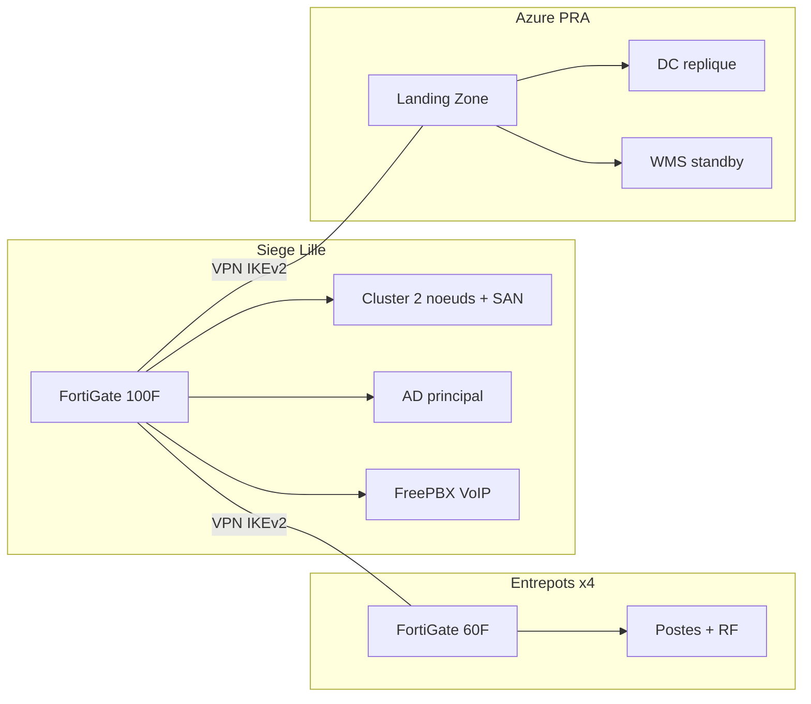
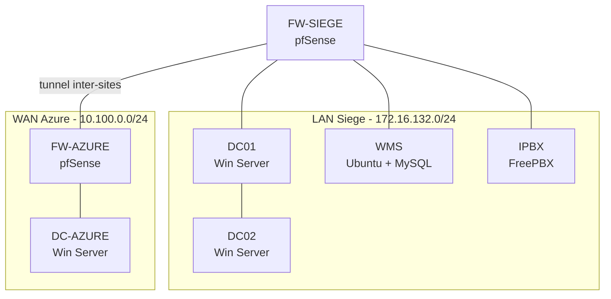

# MSPR - NordTransit Logistics

> **Equipe** : PUICHAUD Ianis, ABOUYAALA Zaid, LANTSIGBLE Ojvind, LENOGUE Ewan, WANDA NKONG Blaise

NordTransit, c'est une PME logistique dans les Hauts-de-France : 4 entrepots, 240 employes, et un SI qui tient avec du scotch. On modernise tout.

## Le probleme

NordTransit tourne sur un **serveur unique** (Dell R630) sans redondance. Si ce serveur tombe, c'est tout le WMS (gestion d'entrepot) qui s'arrete — et donc les 4 sites.

En vrac, ce qui ne va pas :

- **Pas de PRA** — un sinistre au siege = perte totale des donnees
- **Firewall EOL** — le FortiGate 80D n'est plus mis a jour, les DrayTek sont basiques
- **VPN fragile** — configuration minimale, pas de chiffrement fort
- **VoIP degradee** — aucune QoS, la voix se coupe quand le reseau charge
- **DSI de 4 personnes** — qui gere tout a la main, sans doc, sans supervision

> Detail complet dans [`docs/01-analyse/`](docs/01-analyse/) (contexte client, audit infra, points de douleur)

## Notre solution

On remplace tout le socle par une architecture redondante et securisee :

**En resume** : FortiGate homogenes partout, cluster serveurs HA, AD multi-DC (siege + Azure), QoS VoIP dediee, PRA dans Azure.

**Budget** : 137k EUR sur 150k max — [detail dans le DAT](docs/04-livrables/architecture-technique.md).

> Conception detaillee dans [`docs/02-conception/`](docs/02-conception/) (architecture cible, plan VLAN, securite, migration)

## On l'a prouve : le lab POC

On a monte **7 VMs sur Proxmox** pour tester chaque brique de l'architecture :

**4 tests, 4 PASS :**

| Test | Ce qu'on prouve | Resultat |
|------|-----------------|----------|
| QoS VoIP | La voix reste claire sous charge reseau (500 Mbps) | **0.1ms** latence, **0%** perte |
| Failover AD | DC02 prend le relais si DC01 tombe | Bascule **immediate** |
| Tunnel Azure | Le site Azure communique avec le siege | Ping + DNS + replication **OK** |
| Failover WMS | La BDD survit a un reboot serveur | **20s** de reboot, 0 perte |

> Guides pas-a-pas dans [`docs/03-lab-poc/`](docs/03-lab-poc/) (00 a 07, dans l'ordre) — resultats detailles dans [`07-tests-validation`](docs/03-lab-poc/07-tests-validation.md)

## Les livrables

Ce qu'on rend au jury :

| Document | Description | Fichier |
|----------|-------------|---------|
| Architecture technique (DAT) | Architecture complete, justifications, budget | [`architecture-technique.md`](docs/04-livrables/architecture-technique.md) |
| Strategie de migration | 6 phases, planning 6 semaines, rollback | [`strategie-migration.md`](docs/04-livrables/strategie-migration.md) |
| Config pare-feu | Regles FortiGate, QoS, CLI production | [`pare-feu.md`](docs/04-livrables/configs/pare-feu.md) |
| Config VPN IPsec | IKEv2, 5 tunnels, CLI production | [`vpn-ipsec.md`](docs/04-livrables/configs/vpn-ipsec.md) |
| Note WMS | Analyse SPOF, recommandations HA | [`note-recommandation-wms.md`](docs/04-livrables/note-recommandation-wms.md) |
| Guide depannage ToIP | Arbre decision N1/N2 | [`guide-depannage-toip.md`](docs/04-livrables/guide-depannage-toip.md) |

Les exports DOCX sont disponibles dans [`docs/04-livrables/`](docs/04-livrables/) (fichiers `.docx`).

> Regenerer les exports : `python scripts/build_corporate.py` (DOCX stylise) ou `python scripts/build_docs.py --all --format pdf` (PDF via [pandoc](https://pandoc.org/installing.html))

## Reproduire le lab

1. **Prerequis** : Proxmox VE, ~20 Go RAM, ~100 Go disque — [`00-prerequis-lab`](docs/03-lab-poc/00-prerequis-lab.md)
2. **Suivre les guides** dans l'ordre : 01 (reseau) → 02 (pfSense) → 03 (AD) → 04 (VoIP) → 05 (Azure) → 06 (WMS)
3. **Valider** avec les 4 tests : [`07-tests-validation`](docs/03-lab-poc/07-tests-validation.md)

**Raccourci Ansible** : les playbooks dans [`configs/ansible/`](configs/ansible/) automatisent la creation des VMs.

> Guide complet dans [`docs/QUICKSTART.md`](docs/QUICKSTART.md)

## Soutenance

- Plan de presentation (20 min + 30 min jury) : [`plan-presentation.md`](docs/05-soutenance/plan-presentation.md)
- Diaporama : [`MSPR_NordTransit_Presentation.pptx`](docs/05-soutenance/MSPR_NordTransit_Presentation.pptx)

- Glossaire : [`docs/glossaire.md`](docs/glossaire.md)

## Navigation

- **Structure du repo** : [`STRUCTURE.md`](STRUCTURE.md) — description de chaque dossier et fichier
- [Notion projet](https://www.notion.so/MSPR-NordTransit-Logistics-2e095ddfecb18106aee6f23d0c83a063)
