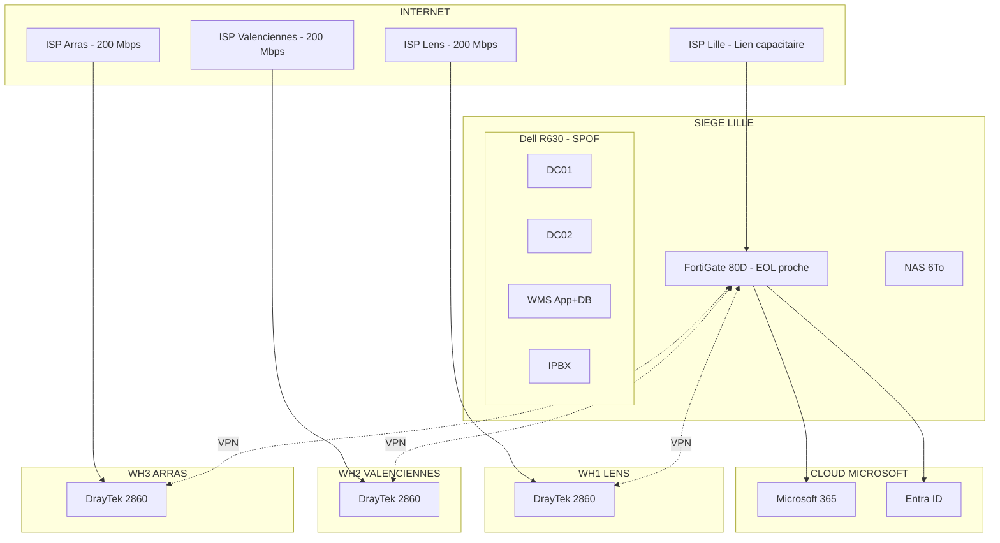
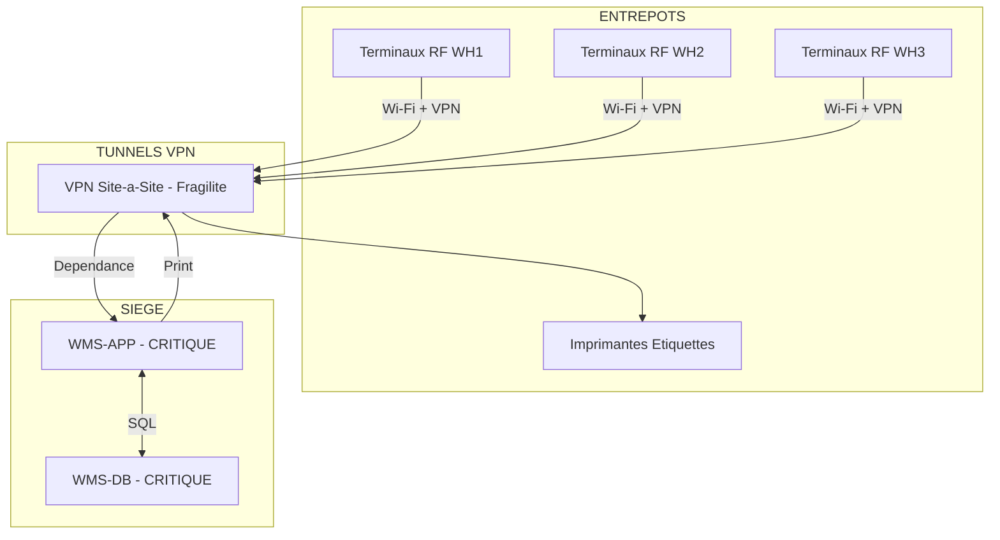
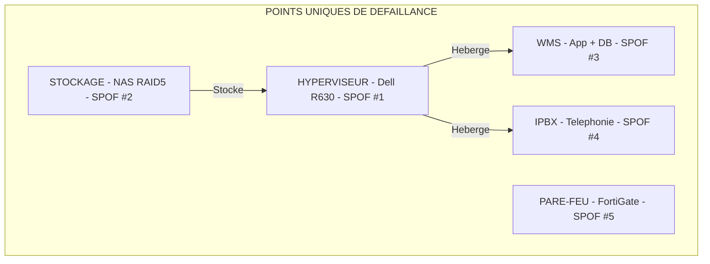
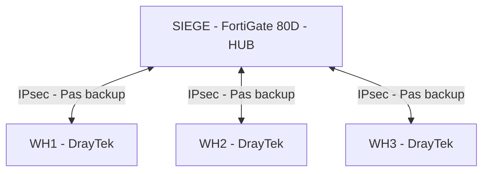

# Schémas réseau AVANT

> Diagrammes de l'architecture actuelle

---

## 1. Architecture globale actuelle

---

## 2. Plan d'adressage actuel

| Site | Réseau | Passerelle | Serveurs | DHCP |
| --- | --- | --- | --- | --- |
| Siège Lille | 192.168.10.0/24 | .254 | .10-.60 | .100-.200 |
| WH1 Lens | 192.168.20.0/24 | .254 | - | .100-.200 |
| WH2 Valenciennes | 192.168.30.0/24 | .254 | - | .100-.200 |
| WH3 Arras | 192.168.40.0/24 | .254 | - | .100-.200 |
| Cross-dock | 192.168.50.0/24 | .254 | - | .100-.200 |
| **Azure (cible)** | 10.100.0.0/16 | - | - | - |

---

## 3. Flux critiques WMS

---

## 4. Points de défaillance (SPOF)

---

## 5. Topologie VPN actuelle (Hub & Spoke)

> **Problème** : Pas de communication directe entre entrepôts, tout passe par le siège
