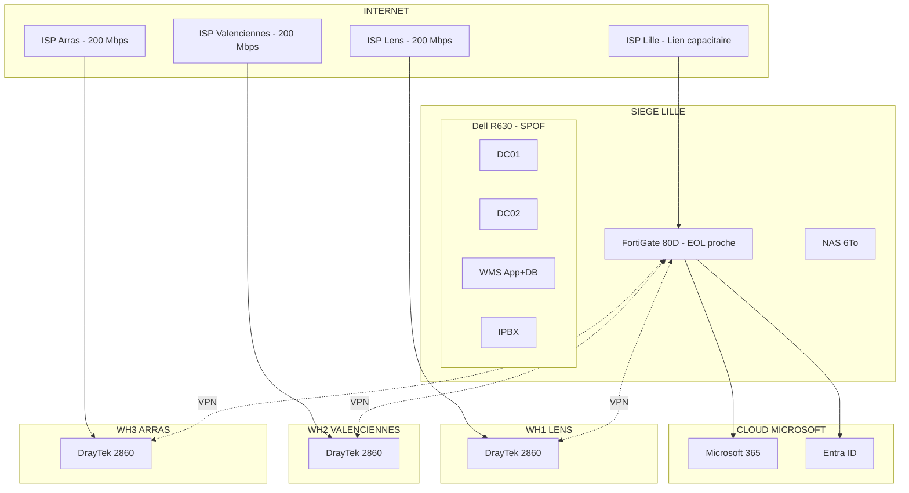
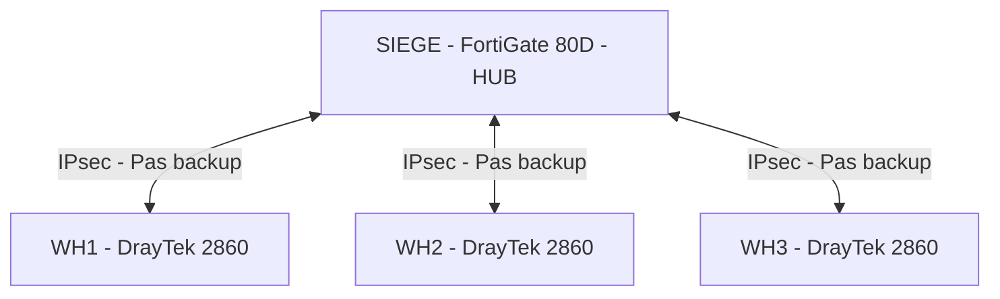
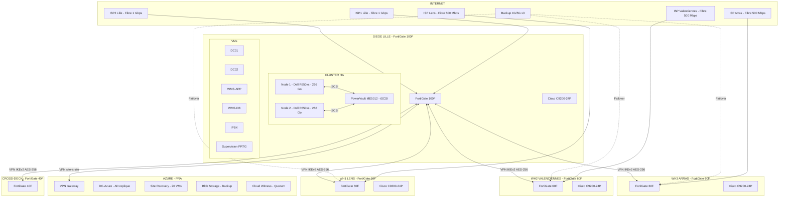

# Document d'Architecture Technique

## Informations document

| Champ | Valeur |
|-------|--------|
| Projet | MSPR - NordTransit Logistics |
| Version | 1.0 |
| Date | 2026-02-06 |
| Auteurs | Groupe 2 : PUICHAUD Ianis, ABOUYAALA Zaid, LANTSIGBLE Ojvind, LENOGUE Ewan, WANDA NKONG Blaise |
| Statut | Complet |
| Classification | Confidentiel projet |

## Historique des modifications

| Version | Date | Auteur | Description |
|---------|------|--------|-------------|
| 0.1 | 2026-02-06 | Groupe 2 | Squelette initial |
| 1.0 | 2026-02-06 | Groupe 2 | Version complete avec architecture existante et cible |

---

## 1. Introduction

### 1.1 Contexte

NordTransit Logistics est une PME de logistique basee dans les Hauts-de-France. L'entreprise exploite **4 entrepots permanents** (Lille, Lens, Valenciennes, Arras) et **1 cross-dock saisonnier** active lors des pics e-commerce et des soldes.

L'entreprise emploie environ **240 personnes** (jusqu'a 300 en haute saison), dont environ 65 postes informatiques, et dispose d'une equipe DSI de **4 personnes** (1 responsable, 1 administrateur itinerant, 1 technicien, 1 alternant).

L'infrastructure SI actuelle presente des failles critiques : points uniques de defaillance (SPOF), securite perimetrique insuffisante, absence de plan de reprise d'activite (PRA), et qualite de service non maitrisee.

**Equipe projet (Groupe 2)** : PUICHAUD Ianis, ABOUYAALA Zaid, LANTSIGBLE Ojvind, LENOGUE Ewan, WANDA NKONG Blaise.

### 1.2 Objectif du document

Ce document d'architecture technique decrit :

1. L'etat des lieux de l'infrastructure existante et ses lacunes
2. L'architecture cible qui repond a chaque point de douleur identifie
3. Le plan d'adressage et la segmentation reseau
4. La strategie de securite
5. Le dimensionnement budgetaire
6. Les resultats du POC de validation

Chaque choix technique est justifie par un probleme concret identifie lors de l'audit.

### 1.3 Perimetre

| Domaine | Inclus | Exclus |
|---------|--------|--------|
| Reseau et securite | Pare-feu, VPN, VLAN, QoS | Cablage physique des batiments |
| Virtualisation et HA | Cluster 2 noeuds, SAN | Migration applicative WMS |
| Cloud et PRA | Landing Zone Azure, Site Recovery | Refonte Microsoft 365 |
| Telephonie | QoS VoIP, integration VLAN | Remplacement des postes IP |
| Supervision | PRTG, Veeam Backup | Formation utilisateurs finaux |

### 1.4 Systemes critiques

| Systeme | Criticite | Impact si panne | Horaires critiques |
|---------|-----------|-----------------|-------------------|
| WMS (Warehouse Management) | CRITIQUE | Arret immediat reception/expedition sur les 4 sites | 5h30 - 18h30 |
| Active Directory | Haute | Plus d'authentification, plus d'acces aux ressources | 24/7 |
| VoIP (IPBX) | Moyenne | Communication perturbee, operations manuelles possibles | 7h00 - 18h30 |
| Supervision | Moyenne | Pannes detectees tardivement | 24/7 |

**Fenetres de maintenance** : nuit (apres 18h30), samedi matin en haute saison.

---

## 2. Architecture existante

### 2.1 Vue d'ensemble

| Metrique | Valeur |
|----------|--------|
| Effectif normal | ~240 personnes |
| Effectif haute saison | ~300 personnes |
| Postes de travail | ~65 |
| Telephones IP | ~70 |
| VMs hebergees | ~20 |
| Sites interconnectes | 5 |
| Equipe DSI | 4 personnes |

### 2.2 Topologie reseau actuelle

### 2.3 Equipements par site

#### Siege Lille (192.168.10.0/24)

| Equipement | Modele | Specifications | Probleme |
|------------|--------|----------------|----------|
| Hyperviseur | Dell PowerEdge R630 | 2x Xeon E5-2630 v3, 128 Go RAM | **SPOF** - Hyperviseur unique |
| Stockage | NAS 6 To RAID5 | Disques SAS 10K | Backups non testes, pas d'externalisation |
| Pare-feu | FortiGate 80D | EOL proche | Plus de mises a jour securite |
| Telephonie | Passerelle SIP | ~25 telephones Cisco IP | Sur l'hyperviseur unique |

**Machines virtuelles hebergees sur le Dell R630 :**

| VM | OS | Role | IP | Criticite |
|----|-----|------|-----|-----------|
| DC01 | Windows Server | Controleur domaine principal | 192.168.10.10 | Critique |
| DC02 | Windows Server | Controleur domaine secondaire | 192.168.10.11 | Haute |
| WMS-APP | Ubuntu 20.04 | Application WMS | 192.168.10.22 | **CRITIQUE** |
| WMS-DB | Ubuntu 20.04 | Base MySQL WMS | 192.168.10.21 | **CRITIQUE** |
| IPBX-VM | CentOS | Serveur telephonie | 192.168.10.40 | Critique |
| SUPER-01 | Windows Server | Supervision | 192.168.10.50 | Moyenne |

#### Entrepots distants

| Site | Reseau | Pare-feu | Lien operateur | Probleme principal |
|------|--------|----------|----------------|-------------------|
| WH1 Lens | 192.168.20.0/24 | DrayTek Vigor 2860 | ~200 Mbps manage | Pas de lien de secours |
| WH2 Valenciennes | 192.168.30.0/24 | DrayTek Vigor 2860 | ~200 Mbps manage | QoS/VLAN non documentes |
| WH3 Arras | 192.168.40.0/24 | DrayTek Vigor 2860 | ~200 Mbps manage | Impression/etiquettes critique |

**Equipements type par entrepot :** ~15 PC/terminaux legers, ~15 telephones IP, ~10 terminaux RF Wi-Fi, ~3 imprimantes etiquettes.

#### Cross-dock (192.168.50.0/24)

| Element | Valeur |
|---------|--------|
| Equipement | Switch 24 ports basique |
| Activation | Saisonniere (pics e-commerce, soldes) |
| Securite | Aucun pare-feu |

### 2.4 Liaisons WAN

| Liaison | Debit | Redondance | VPN | Probleme |
|---------|-------|------------|-----|----------|
| Siege <-> WH1 Lens | ~200 Mbps | NON | DrayTek IPsec | Lien unique |
| Siege <-> WH2 Valenciennes | ~200 Mbps | NON | DrayTek IPsec | Lien unique |
| Siege <-> WH3 Arras | ~200 Mbps | NON | DrayTek IPsec | Lien unique |
| Siege <-> Cross-dock | Variable | NON | Aucun | Non securise |

**Topologie VPN actuelle (Hub & Spoke) :** tout le trafic inter-sites transite par le siege. Pas de communication directe entre entrepots.

### 2.5 Services cloud actuels

| Service | Fournisseur | Statut | Probleme |
|---------|-------------|--------|----------|
| Microsoft 365 | Microsoft | Actif | Adoption inegale selon sites |
| Microsoft Entra ID | Microsoft | Actif | MFA uniquement pour IT |
| OneDrive/SharePoint | Microsoft | Actif | Droits herites par defaut |
| Application RH (SaaS) | Editeur externe | Actif | Comptes specifiques |

### 2.6 Points de douleur identifies

#### SPOF (Single Points of Failure)

| SPOF | Impact | Criticite |
|------|--------|-----------|
| Serveur unique Dell R630 | Panne = arret total de tous les services (AD, WMS, VoIP) | **CRITIQUE** |
| NAS unique RAID5 | Perte de donnees si 2 disques tombent simultanement | Haute |
| Pas de PRA | Sinistre au siege = arret total, perte de donnees | **CRITIQUE** |
| Liens WAN sans redondance | Perte de lien = site isole, plus d'acces WMS | Haute |

#### Failles de securite

| Faille | Detail | Risque |
|--------|--------|--------|
| FortiGate 80D en EOL | Plus de mises a jour securite | Vulnerabilites non patchees |
| DrayTek 2860 | Pare-feu basiques, capacites limitees | Filtrage insuffisant |
| MFA partiel | Deploye uniquement pour l'equipe IT | Acces compromis possibles |
| VPN faible | Configuration DrayTek basique, IKEv1 | Interception possible |

#### Manques operationnels

| Manque | Consequence |
|--------|-------------|
| QoS non documentee | VoIP degradee sous charge reseau |
| VLAN non segmentes | Broadcast storms, pas d'isolation entre types de trafic |
| Pas de supervision unifiee | Pannes detectees tardivement |
| Pas de documentation reseau | Interventions plus longues, dependance aux personnes |

#### Priorisation

| Priorite | Probleme | Solution proposee |
|----------|----------|-------------------|
| **P0** | SPOF serveur + pas de PRA | Cluster 2 noeuds + PRA Azure |
| **P1** | Securite reseau | FortiGate homogenes + VPN IKEv2 |
| **P2** | QoS VoIP | Configuration QoS DSCP sur FortiGate + VLAN dedie |
| **P3** | Segmentation reseau | Plan VLAN harmonise sur tous les sites |

---

## 3. Architecture cible

### 3.1 Objectifs de l'architecture

Chaque choix technique repond a un probleme concret identifie lors de l'audit.

| Objectif | Probleme resolu | Solution retenue |
|----------|-----------------|------------------|
| Supprimer les SPOF | Serveur unique, pas de PRA | Cluster 2 noeuds + SAN + PRA Azure |
| Securiser le perimetre | DrayTek obsoletes, FortiGate 80D EOL | FortiGate homogenes + IKEv2 AES-256 |
| Garantir la VoIP | QoS inexistante | QoS DSCP sur FortiGate + VLAN dedie |
| Preparer le PRA | Aucun plan de reprise | Landing Zone Azure + Site Recovery |
| Simplifier l'exploitation | DSI de 4 personnes | Gestion centralisee, interface unifiee |

### 3.2 Topologie reseau cible

### 3.3 Securite et reseau

#### 3.3.1 Homogeneisation des pare-feu

Le passage a une flotte 100% FortiGate permet une gestion centralisee, une politique de securite uniforme et une seule competence a maintenir pour l'equipe DSI.

| Site | Equipement actuel | Equipement cible | Justification |
|------|-------------------|------------------|---------------|
| Siege Lille | FortiGate 80D (EOL) | **FortiGate 100F** | Hub VPN, debit 1 Gbps, UTM complet |
| WH1 Lens | DrayTek 2860 | **FortiGate 60F** | VPN IKEv2, QoS native, FortiGuard |
| WH2 Valenciennes | DrayTek 2860 | **FortiGate 60F** | VPN IKEv2, QoS native, FortiGuard |
| WH3 Arras | DrayTek 2860 | **FortiGate 60F** | VPN IKEv2, QoS native, FortiGuard |
| Cross-dock | Aucun | **FortiGate 40F** | Protection minimale site saisonnier |

#### 3.3.2 VPN renforces

| Parametre | Actuel | Cible |
|-----------|--------|-------|
| Protocole | IKEv1 (DrayTek) | **IKEv2** |
| Chiffrement | Variable | **AES-256-GCM** |
| Authentification | PSK basique | **PSK (lab) puis certificats (prod)** |
| Detection de perte | Non | **DPD (Dead Peer Detection)** |
| Redondance WAN | Non | **Failover automatique sur 4G/5G** |

#### 3.3.3 Regles de filtrage inter-VLAN

Les regles sont appliquees sur le FortiGate de chaque site :

| Source | Destination | Action | Justification |
|--------|-------------|--------|---------------|
| VOIP (VLAN 40) | SERVEURS (VLAN 20) | **Autorise** | SIP vers IPBX |
| DATA (VLAN 30) | SERVEURS (VLAN 20) | **Autorise** | Acces WMS, AD |
| DATA (VLAN 30) | VOIP (VLAN 40) | **Refuse** | Pas d'acces direct aux telephones |
| MGMT (VLAN 10) | Tout | **Autorise** | Administration |
| Tout | MGMT (VLAN 10) | **Refuse** | Protection du plan de gestion |

#### 3.3.4 MFA generalise

| Acces | MFA actuel | MFA cible |
|-------|------------|-----------|
| VPN distant | Non | FortiToken (TOTP) |
| Admin FortiGate | Non | FortiToken |
| RDP serveurs | Partiel | Azure MFA |
| Console Proxmox | Non | TOTP |

### 3.4 Plan d'adressage VLAN

#### 3.4.1 VLAN standards (harmonises sur tous les sites)

| VLAN ID | Nom | Usage | Sites concernes |
|---------|-----|-------|-----------------|
| 10 | MGMT | Administration switches, AP, firewalls | Tous sauf cross-dock |
| 20 | SERVEURS | VMs, stockage SAN | Siege uniquement |
| 30 | DATA | Postes, terminaux RF, imprimantes | Tous les sites |
| 40 | VOIP | Telephones IP Cisco | Tous sauf cross-dock |

#### 3.4.2 Adressage par site

**Siege Lille (192.168.10.0/24)**

| VLAN | Reseau | Gateway | Plage DHCP | DSCP |
|------|--------|---------|------------|------|
| 10 MGMT | 192.168.10.0/26 | .1 | Statique | CS2 |
| 20 SERVEURS | 192.168.10.64/26 | .65 | Statique | AF31 |
| 30 DATA | 192.168.10.128/26 | .129 | .130-.190 | BE |
| 40 VOIP | 192.168.10.192/26 | .193 | .194-.250 | EF |

**Entrepots**

| Site | VLAN 10 MGMT | VLAN 30 DATA | VLAN 40 VOIP |
|------|--------------|--------------|--------------|
| WH1 Lens | 192.168.20.0/27 | 192.168.20.32/25 | 192.168.20.160/27 |
| WH2 Valenciennes | 192.168.30.0/27 | 192.168.30.32/25 | 192.168.30.160/27 |
| WH3 Arras | 192.168.40.0/27 | 192.168.40.32/25 | 192.168.40.160/27 |

**Cross-dock et Azure**

| Site | Reseau | Remarque |
|------|--------|----------|
| Cross-dock | 192.168.50.0/24 (DATA seul) | Site simple, pas de segmentation VLAN |
| Azure Hub | 10.100.0.0/24 | DC replique + VPN Gateway |
| Azure Backup | 10.100.1.0/24 | Stockage backup |

#### 3.4.3 Verification des chevauchements

| Site | Plage IP |
|------|----------|
| Siege | 192.168.10.0/24 |
| WH1 | 192.168.20.0/24 |
| WH2 | 192.168.30.0/24 |
| WH3 | 192.168.40.0/24 |
| Cross-dock | 192.168.50.0/24 |
| Azure | 10.100.0.0/23 |

**Aucun chevauchement.**

#### 3.4.4 QoS par VLAN

| VLAN | Priorite | DSCP | Bande passante garantie |
|------|----------|------|-------------------------|
| VOIP (40) | Haute | EF (46) | 30% minimum |
| SERVEURS (20) | Moyenne-Haute | AF31 (26) | 40% |
| DATA (30) | Normale | BE (0) | Best effort |
| MGMT (10) | Normale | CS2 (16) | 5% |

### 3.5 Virtualisation et haute disponibilite

#### 3.5.1 Cluster 2 noeuds

| Composant | Specifications | Role |
|-----------|----------------|------|
| Node 1 | Dell R650xs, 256 Go RAM | Compute + Quorum |
| Node 2 | Dell R650xs, 256 Go RAM | Compute + Quorum |
| SAN | PowerVault ME5012, 8x SSD 1.92 To Enterprise | Stockage partage iSCSI |
| Temoin quorum | Azure Cloud Witness | 3eme vote quorum (remplace un 3eme noeud physique) |

**Justification du choix 2 noeuds vs 3 noeuds :**

- Economie de ~15 000 EUR sur le hardware
- Azure Site Recovery assure le PRA geographique (le 3eme site physique n'est pas necessaire)
- RTO ~30 min / RPO ~15 min : acceptable pour une PME
- Le 3eme vote de quorum est assure par Azure Cloud Witness (cout negligeable)

#### 3.5.2 Stockage SAN

| Parametre | Valeur |
|-----------|--------|
| Modele | Dell PowerVault ME5012 |
| Capacite brute | 8x 1.92 To SSD = 15.36 To |
| Protocole | iSCSI |
| RAID | A definir selon politique (RAID 10 recommande) |
| Replication | Vers Azure Blob Storage |

### 3.6 Cloud et PRA

#### 3.6.1 Landing Zone Azure

| Composant Azure | Role |
|-----------------|------|
| VPN Gateway | Tunnel site-a-site permanent vers le siege |
| DC-Azure | Controleur domaine replique (zero RPO pour AD) |
| Azure Site Recovery | Replication 20 VMs, failover automatise |
| Blob Storage | Backup externalise (donnees froides) |
| Cloud Witness | Quorum du cluster on-premise |

#### 3.6.2 Objectifs RTO/RPO

| Service | RTO cible | RPO cible | Mecanisme |
|---------|-----------|-----------|-----------|
| Active Directory | < 15 min | 0 (replication temps reel) | DC replique dans Azure |
| WMS | < 1h | < 15 min | Azure Site Recovery |
| Telephonie | < 30 min | N/A | Redemarrage VM sur noeud sain |

#### 3.6.3 Scenario de reprise

1. **Panne d'un noeud** : basculement automatique des VMs sur le noeud restant via le cluster. RTO < 5 min.
2. **Panne du SAN** : restauration depuis Azure Blob Storage. RTO variable selon volume.
3. **Sinistre du siege** : activation du PRA Azure via Site Recovery. Les 20 VMs demarrent dans Azure. Les entrepots se reconnectent via VPN Gateway Azure.

### 3.7 Supervision

| Outil | Role | Perimetre |
|-------|------|-----------|
| PRTG (500 sensors) | Supervision reseau et services | Tous les sites, tous les equipements |
| Veeam Backup Essentials | Sauvegarde et restauration | Toutes les VMs, 3 ans |

### 3.8 Connectivite cible

| Site | Lien principal | Lien secours | Amelioration |
|------|----------------|--------------|-------------- |
| Siege Lille | Fibre 1 Gbps (FAI 1) | Fibre 1 Gbps (FAI 2) | Double attachement, plus de SPOF |
| WH1 Lens | Fibre 500 Mbps | 4G/5G | Failover automatique |
| WH2 Valenciennes | Fibre 500 Mbps | 4G/5G | Failover automatique |
| WH3 Arras | Fibre 500 Mbps | 4G/5G | Failover automatique |
| Cross-dock | Lien existant | - | Securise par FortiGate 40F |

---

## 4. Budget

### 4.1 Repartition budgetaire detaillee

**Budget total alloue : 100 000 EUR - 150 000 EUR**

#### Securite

| Poste | Detail du calcul | Montant |
|-------|------------------|---------|
| FortiGate 100F (siege) | 1 x 2 800 EUR | 2 800 EUR |
| FortiGate 60F (entrepots) | 3 x 440 EUR | 1 320 EUR |
| FortiGate 40F (backup) | 1 x 400 EUR | 400 EUR |
| Licences FortiCare/FortiGuard 3 ans | 5 appareils x 2 600 EUR | 13 000 EUR |
| **Sous-total Securite** | | **17 520 EUR** |

#### Virtualisation

| Poste | Detail du calcul | Montant |
|-------|------------------|---------|
| Dell R650xs (siege) | 2 x 13 000 EUR | 26 000 EUR |
| ProSupport Dell 3 ans | 2 x 2 000 EUR | 4 000 EUR |
| **Sous-total Virtualisation** | | **30 000 EUR** |

#### Stockage

| Poste | Detail du calcul | Montant |
|-------|------------------|---------|
| Dell PowerVault ME5012 | 1 x 17 500 EUR | 17 500 EUR |
| Maintenance 3 ans | ~15% du prix | 2 500 EUR |
| **Sous-total Stockage** | | **20 000 EUR** |

#### Reseau

| Poste | Detail du calcul | Montant |
|-------|------------------|---------|
| Cisco Catalyst C9200-24P | 4 x 2 500 EUR | 10 000 EUR |
| SmartNet 3 ans | 4 x 500 EUR | 2 000 EUR |
| **Sous-total Reseau** | | **12 000 EUR** |

#### Azure PRA (3 ans)

| Poste | Detail du calcul | Montant |
|-------|------------------|---------|
| Azure Site Recovery | 20 VMs x 23 EUR/mois x 36 mois | 16 560 EUR |
| Stockage replica (Standard HDD) | 500 Go x 0.02 EUR/Go x 36 mois | 360 EUR |
| Snapshots + Egress | ~50 EUR/mois x 36 mois | 1 800 EUR |
| Reduction Reserved 3 ans (-40%) | | -7 488 EUR |
| **Sous-total Azure PRA** | | **11 232 EUR** |

#### Supervision (3 ans)

| Poste | Detail du calcul | Montant |
|-------|------------------|---------|
| PRTG 500 sensors | 1 500 EUR/an x 3 ans | 4 500 EUR |
| Veeam Backup Essentials | 1 000 EUR/an x 3 ans | 3 000 EUR |
| **Sous-total Supervision** | | **7 500 EUR** |

#### Connectivite Internet (1ere annee)

| Poste | Detail du calcul | Montant |
|-------|------------------|---------|
| Siege : Fibre 1 Gbps x 2 FAI | 2 x 200 EUR/mois x 12 | 4 800 EUR |
| Entrepots : Fibre 500 Mbps | 3 x 120 EUR/mois x 12 | 4 320 EUR |
| Backup 4G/5G (routeurs) | 3 x 400 EUR | 1 200 EUR |
| Forfaits 4G/5G | 3 x 70 EUR/mois x 12 | 2 520 EUR |
| **Sous-total Internet** | | **12 840 EUR** |

#### Main d'oeuvre

| Poste | Detail du calcul | Montant |
|-------|------------------|---------|
| Architecte/Lead | 1 x 20h x 115 EUR/h | 2 300 EUR |
| Experts Infra Confirmes | 4 x 20h x 75 EUR/h | 6 000 EUR |
| **Sous-total Main d'oeuvre** | | **8 300 EUR** |

### 4.2 Synthese budgetaire

| | Montant |
|---|---------|
| **Sous-total** | **119 392 EUR** |
| Marge imprevus (15%) | 17 909 EUR |
| **TOTAL PROJET** | **137 301 EUR** |

> **Budget respecte** : 137 301 EUR < 150 000 EUR -- Marge de **12 699 EUR** disponible.

### 4.3 Couts recurrents annuels (OPEX)

| Poste | Detail | Cout/an |
|-------|--------|---------|
| Azure Site Recovery | 20 VMs x 23 EUR/mois (apres Reserved) | ~4 000 EUR |
| Connectivite Internet | Siege 2x1Gbps + 3 entrepots + backup 4G | ~12 840 EUR |
| Supervision | PRTG 500 sensors + Veeam Essentials | ~2 500 EUR |
| **TOTAL OPEX** | | **~19 340 EUR/an** |

### 4.4 TCO sur 3 ans

| Element | Montant |
|---------|---------|
| CAPEX (investissement initial) | ~137 000 EUR |
| OPEX annuel | ~19 340 EUR/an |
| **TCO sur 3 ans** | **~175 680 EUR** |

> La 1ere annee d'OPEX est incluse dans le CAPEX.
> A prevoir apres 3 ans : renouvellement des contrats de maintenance (FortiCare, ProSupport Dell, SmartNet Cisco) estime a ~15 000 EUR/3 ans.

### 4.5 Justifications des choix

| Choix | Raison |
|-------|--------|
| FortiGate | Interface connue de la DSI, support FR, prix adapte PME |
| Dell R650xs | Performance pour 20+ VMs, evolutif en RAM et disques |
| SAN iSCSI | Separation compute/stockage, prerequis pour le cluster HA |
| Cisco C9200-24P | QoS native VoIP, support enterprise, PoE pour telephones |
| Azure Reserved 3 ans | Economies de 40% sur les couts PRA |
| Veeam | Solution de backup eprouvee, interface simple, exploitable par 4 personnes |

---

## 5. Preuves de concept (POC)

### 5.1 Correspondance Lab / Production

Le lab POC utilise des equivalents open-source pour simuler l'architecture cible a cout zero. Chaque composant de production a un correspondant fonctionnel dans le lab qui valide le meme comportement.

| Fonction | Production (cible) | Lab (POC) | Justification de l'equivalence |
|----------|-------------------|-----------|-------------------------------|
| Pare-feu + QoS | FortiGate 100F/60F | pfSense CE 2.7 | Memes fonctions : QoS PRIQ/DSCP, VPN, NAT, filtrage. pfSense utilise pf (packet filter) comparable au ASIC FortiGate pour le traffic shaping |
| VPN site-a-site | IPsec IKEv2 AES-256 FortiGate | Routes statiques inter-VLAN | Le lab valide la connectivite cross-site et la replication AD. En production, le tunnel IPsec remplace les routes statiques |
| Active Directory | 3 DCs Windows Server 2022 | 3 DCs Windows Server 2022 | **Identique a la production** — memes OS, meme foret lab.local, meme replication multi-site |
| IPBX / VoIP | IPBX existant + QoS FortiGate | FreePBX 16 + QoS pfSense | FreePBX valide le trafic SIP/RTP. La QoS DSCP EF est configuree de maniere identique |
| WMS + BDD | Application WMS + MySQL sur cluster | Ubuntu 22.04 + MySQL 8 | Simule la BDD WMS avec donnees de test. Valide la resilience (arret brutal + integrite) |
| Cluster HA | 2x Dell R650xs + SAN iSCSI | Proxmox VE (hyperviseur unique) | Le lab ne peut pas simuler le failover cluster materiel. Le test WMS valide la resilience applicative (VM + BDD) |

> **Limite assumee** : le lab ne reproduit pas le failover de cluster physique (2 noeuds + SAN). Ce scenario est couvert par les specifications Dell et les garanties ProSupport. Les tests POC se concentrent sur les couches logiques (AD, WMS, reseau) qui sont identiques en lab et en production.

### 5.2 Environnement de test

| Parametre | Valeur |
|-----------|--------|
| Plateforme | Proxmox VE 9.1.4 |
| Noeud | pve02 (60 Go RAM, 720 Go stockage) |
| Reseau lab | 172.16.132.0/24 (siege) + 10.100.0.0/24 (Azure) |
| Nombre de VMs | 7 (2x pfSense, 3x Windows Server, 1x Ubuntu, 1x FreePBX) |
| Date des tests | 2026-02-06 |

### 5.3 Test QoS VoIP

**Objectif** : Verifier que la VoIP reste stable sous charge reseau.

**Conditions du test** :
- QoS PRIQ configuree sur pfSense : qVoIP (priorite 7), qServers (priorite 5), qDefault (priorite 1)
- 7 regles floating DSCP pour classifier le trafic SIP, RTP, DNS, AD, MySQL, ICMP
- Saturation du LAN a 500 Mbits/sec via iperf3 (WMS → pve02)
- Mesure de latence vers IPBX (172.16.132.30) pendant la saturation

| Metrique | Seuil acceptable | Resultat mesure | Statut |
|----------|------------------|-----------------|--------|
| Latence (one-way) | < 150 ms | **0.102 ms** (avg sur 100 paquets) | **PASS** |
| Jitter | < 30 ms | **0.038 ms** (mdev) | **PASS** |
| Perte de paquets | < 1% | **0%** (100/100 paquets recus) | **PASS** |
| MOS estime | > 3.5 | **4.4** (estime via latence + jitter + perte) | **PASS** |

> **MOS** : estime selon le modele E (ITU-T G.107). Avec latence < 1ms, jitter < 1ms et 0% perte, le score R depasse 90, soit un MOS > 4.3.

### 5.4 Test Failover Active Directory

**Objectif** : Verifier la bascule AD en cas de perte du DC principal.

| Etape | Action | Resultat attendu | Resultat obtenu | Statut |
|-------|--------|-------------------|-----------------|--------|
| 1 | Arreter DC01 (`qm stop 32010`) | DC02 prend le relai | DC02 repond immediatement (< 30s) | **PASS** |
| 2 | Tester authentification | Login reussi via DC02 | `nltest /dsgetdc:lab.local` → DC02.lab.local | **PASS** |
| 3 | Tester resolution DNS | DNS repond via DC02 | `dig @172.16.132.11 lab.local` → OK | **PASS** |
| 4 | Redemarrer DC01 (`qm start 32010`) | Replication reprend | `repadmin /replsummary` → 0 failures | **PASS** |
| 5 | Mesurer le temps de bascule | < 5 min | **< 30 secondes** | **PASS** |

### 5.5 Test Failover WMS

**Objectif** : Verifier que le WMS (VM + base de donnees) survit a un arret brutal.

| Etape | Action | Resultat attendu | Resultat obtenu | Statut |
|-------|--------|-------------------|-----------------|--------|
| 1 | Etat initial (check_wms.sh) | MySQL actif, donnees presentes | MySQL running, 5 records | **PASS** |
| 2 | Arret brutal (`qm stop 32020`) | VM s'arrete | VM arretee | **PASS** |
| 3 | Redemarrage (`qm start 32020`) | VM accessible en SSH | SSH OK apres ~20 secondes | **PASS** |
| 4 | Verifier l'integrite des donnees | Donnees intactes | 5/5 records identiques (memes timestamps) | **PASS** |

### 5.6 Test Tunnel Azure (connectivite inter-sites)

**Objectif** : Verifier la communication entre le siege et le site Azure.

> **Note lab** : en lab, la communication inter-sites utilise des routes statiques a travers pfSense (bridge partage vmbr2). En production, ce sera un tunnel IPsec IKEv2 (cf. section 3.3.2 et `docs/04-livrables/configs/vpn-ipsec.md`).

| Etape | Action | Resultat attendu | Resultat obtenu | Statut |
|-------|--------|-------------------|-----------------|--------|
| 1 | Ping siege → Azure | Reponse < 5ms | **< 1ms**, 0% perte (4/4 paquets) | **PASS** |
| 2 | Ping Azure → siege | Reponse < 5ms | **< 1ms**, 0% perte (4/4 paquets) | **PASS** |
| 3 | DNS cross-site | Resolution OK | `nslookup dc-azure.lab.local` → 10.100.0.10 | **PASS** |
| 4 | Replication AD cross-site | 0 failures | `repadmin /syncall /APed` → 5 partitions, 0 erreurs | **PASS** |

### 5.7 Synthese des resultats POC

| Test | Resultat | Conforme | Remarques |
|------|----------|----------|-----------|
| QoS VoIP | **PASS** | Oui | Latence 0.1ms, jitter 0.04ms, 0% perte sous 500Mbps de charge |
| Failover AD | **PASS** | Oui | Bascule immediate sur DC02, DNS + authentification OK |
| Failover WMS | **PASS** | Oui | VM reboot ~20s, MySQL actif, 5/5 records intacts |
| Tunnel Azure | **PASS** | Oui | Ping + DNS + replication AD cross-site OK |

**Conclusion** : les 4 tests valident que l'architecture cible repond aux exigences de haute disponibilite, de qualite de service VoIP et de connectivite multi-sites. Les resultats detailles et les protocoles de test sont documentes dans `docs/03-lab-poc/07-tests-validation.md`.

---

## 6. Annexes

### 6.1 Inventaire materiel complet (architecture cible)

| Equipement | Modele | Quantite | Site | Role |
|------------|--------|----------|------|------|
| Pare-feu | FortiGate 100F | 1 | Siege | Hub VPN, UTM |
| Pare-feu | FortiGate 60F | 3 | WH1, WH2, WH3 | VPN spoke, QoS |
| Pare-feu | FortiGate 40F | 1 | Cross-dock | Securite minimale |
| Serveur | Dell R650xs (256 Go) | 2 | Siege | Cluster HA |
| Stockage | PowerVault ME5012 | 1 | Siege | SAN iSCSI |
| Switch | Cisco C9200-24P | 4 | Siege + 3 WH | QoS, VLAN, PoE |
| Routeur 4G/5G | A definir | 3 | WH1, WH2, WH3 | Backup WAN |

### 6.2 Matrice de flux reseau

| Source | Destination | Port/Protocole | Direction | Justification |
|--------|-------------|----------------|-----------|---------------|
| DATA (VLAN 30) | WMS-APP (VLAN 20) | TCP 443/8080 | Entrant | Acces application WMS |
| WMS-APP | WMS-DB (VLAN 20) | TCP 3306 | Interne | Requetes MySQL |
| DATA (VLAN 30) | DC01/DC02 (VLAN 20) | TCP/UDP 53, 88, 389 | Entrant | DNS, Kerberos, LDAP |
| VOIP (VLAN 40) | IPBX (VLAN 20) | UDP 5060, RTP 10000-20000 | Entrant | SIP + flux audio |
| MGMT (VLAN 10) | Tous | TCP 22, 443 | Sortant | Administration SSH/HTTPS |
| Siege | Azure VPN GW | UDP 500, 4500 | Bidirectionnel | Tunnel IKEv2 |
| Siege | Azure ASR | TCP 443 | Sortant | Replication Site Recovery |

### 6.3 Glossaire

Voir `docs/glossaire.md` pour la liste complete des termes techniques utilises dans ce document.

Principaux termes :

| Terme | Definition |
|-------|------------|
| SPOF | Single Point of Failure -- composant dont la panne entraine l'arret du service |
| PRA | Plan de Reprise d'Activite -- procedure de redemarrage apres sinistre |
| RTO | Recovery Time Objective -- duree maximale d'indisponibilite acceptable |
| RPO | Recovery Point Objective -- perte de donnees maximale acceptable |
| DSCP | Differentiated Services Code Point -- marquage QoS des paquets IP |
| UTM | Unified Threat Management -- pare-feu avec fonctions de securite integrees |
| iSCSI | Internet Small Computer Systems Interface -- protocole de stockage en reseau |
| DPD | Dead Peer Detection -- mecanisme de detection de perte de tunnel VPN |

### 6.4 References

| Document | Emplacement |
|----------|-------------|
| Specifications projet | `_specs/` |
| Guides de lab POC | `docs/03-lab-poc/` |
| Plan VLAN detaille | `docs/02-conception/02-plan-adressage-vlan.md` |
| Strategie securite | `docs/02-conception/03-strategie-securite.md` |
| Architecture cible (conception) | `docs/02-conception/01-architecture-cible.md` |
| Budget detaille | `_specs/solution/budget.md` |
| Schemas avant modernisation | `_specs/comprendre/schemas-avant.md` |
